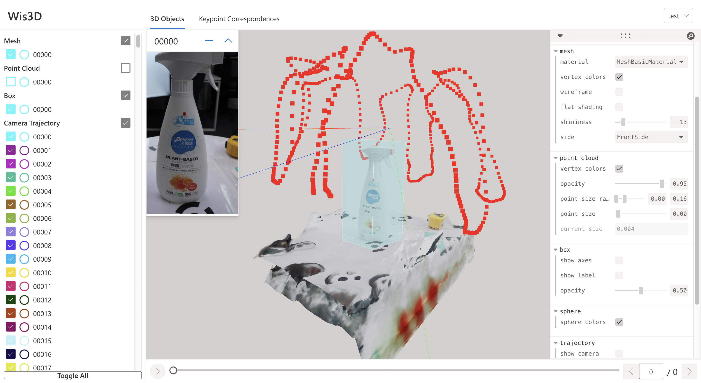

.. _3d_objects:

3D Objects
**********

3D Objects is the first tab of the Web page. The leftmost panel on the web page is the **object list**. 
The rightmost panel is the **control panel**. You can adjust the properties of 3D objects in the panel. 
The middle part displays the main 3D content.

Wis3D provides visualization of mesh, point cloud, camera trajectory, voxel grid, and basic geometry including line, box, and sphere.

Visualization
=============

Mesh
----
Mesh can be added in three ways:

* File path
* Mesh definition (vertices, faces, and vertex_colors)
* `trimesh.Trimesh <https://trimsh.org/trimesh.html#trimesh.Trimesh>`_

.. code-block:: python

    # Add mesh by path
    wis3d.add_mesh(path, name: str = None)

    # Add mesh by definition 
    wis3d.add_mesh(vertices, faces, vertex_colors, name: str = None)

    # Add mesh loaded by `trimesh` 
    wis3d.add_mesh(mesh: trimesh.Trimesh, name: str = None)

Wis3D supports four types of materials: ``MeshBasicMaterial``, ``MeshStandardMaterial``, ``MeshNormalMaterial``, and ``MeshPhongMaterial``. 
You can set whether to use vertex colors and wireframe for rendering and which side of faces will be rendered - front, back, or both.

At the same time, according to the specific material, you can set whether to use flat shading and specific shininess for display.

Point Clouds
------------

Point clouds can be added in three ways: 

* File path
* Point cloud definition (vertices and colors)
* `trimesh.PointCloud <https://trimsh.org/trimesh.html#trimesh.PointCloud>`_

.. code-block:: python

    # Add point cloud by path
    wis3d.add_point_cloud(path, name: str = None)

    # Add point cloud by definition
    wis3d.add_point_cloud(vertices, colors, name: str = None)

    # Add point cloud loaded by `trimesh`
    wis3d.add_point_cloud(pcd: trimesh.PointCloud, name: str = None)

Wis3D can set whether the point cloud is displayed with vertex color and the specific point size of the point cloud.

Camera Trajectory
-----------------

Camera Trajectory is added through the transformation matrix.

.. code-block:: python

    # Add camera trajectory by camera poses
    wis3d.add_camera_trajectory(poses, name: str = None)

Wis3D can set whether to display the camera, whether to view the scene from the camera perspective, 
the size and color of the point of camera position, and the color of the trajectory.

Voxel Grid
----------

Voxel gird can be added in two ways: 

* File path(support ``VOX`` and ``BINVOX`` file)
* Boxes(box centers and unified size)

The color can be added to each box when using boxes to add voxel.

.. code-block:: python

    # Add voxel by file path
    wis3d.add_voxel (path, name: str = None)

    # Add voxels by boxes
    wis3d.add_voxel (voxel_centers, voxel_size, colors, name: str = None)

Basic Geometry (Line, Box, Sphere)
---------------------------------

Wis3D supports adding lines, boxes, and spheres.

Line
~~~~

Lines are added by vertex sets, and colors can be added to each line at the same time. 
If color exists, the start points, the endpoints, and color dimensions must be consistent.

.. code-block:: python

    # Add lines by vertex set
    wis3d.add_lines(start_points, end_points, colors = None, name: str = None)

Wis3D can set whether lines use vertex colors for display and the line width of lines.

Box
~~~

Boxes can be added in two ways: 

* Corners
* Definition (position, Euler, and extent)

Simultaneously, the box supports setting and displaying the label attribute.

.. code-block:: python

    # Add boxes by corners
    wis3d.add_boxes(corners, order: Iterable[int] = (0, 1, 2, 3, 4, 5, 6, 7), labels: Iterable[str] = None, name: str = None)
    
    # Add boxes by definition
    wis3d.add_boxes(positions, eulers, extents, labels: Iterable[str] = None, name: str = None)

Wis3D can set whether to show axes and labels of the box and also supports the display of box attributes including position, scale, and rotation.

Sphere
~~~~~~

Spheres are added through centers and radius. If the ``radius`` is an instance of ``float``, all spheres have the same radius, otherwise, the dimension of the
``radius`` must be the same as the dimension of the center. At the same time, you can set the color for each sphere.

.. code-block:: python

    # Add spheres by definition
    wis3d.add_spheres(centers, radius, colors = None, name = None)

Image
-----

Image can be added by

* File path
* Definition
* `PIL.Image.Image <https://pillow.readthedocs.io/en/stable/reference/Image.html#PIL.Image.Image>`_

.. code-block:: python

    # Add image by file path
    wis3d.add_image(path, name: str = None)

    # Add image by definition
    wis3d.add_image(data, name: str = None)
    
    # Add image by `PIL.Image`
    wis3d.add_image(image: Image.Image, name: str = None)

Shortcuts
========

+------------------+-----------------------------+
|Shortcut          |Description                  |
+==================+=============================+
|``B``             |Back to initial view         |
+------------------+-----------------------------+
|``Z``             |Change zoom speed            |
+------------------+-----------------------------+
|``ArrowUp``/      |Control camera panning       |
|``ArrowDown``/    |                             |
|``ArrowRight``/   |                             |
|``ArrowLeft``     |                             |
+------------------+-----------------------------+
|``A``             |Switch to previous scene     |
+------------------+-----------------------------+
|``D``             |Switch to next scene         |
+------------------+-----------------------------+
|``Q``             |Switch to the first scene    |
+------------------+-----------------------------+
|``E``             |Switch to the last scene     |
+------------------+-----------------------------+
|``W``/``S``       |Change sequence              |
+------------------+-----------------------------+
|Double            |Reset object to center and   |
|Click             |zoom in                      |
+------------------+-----------------------------+

