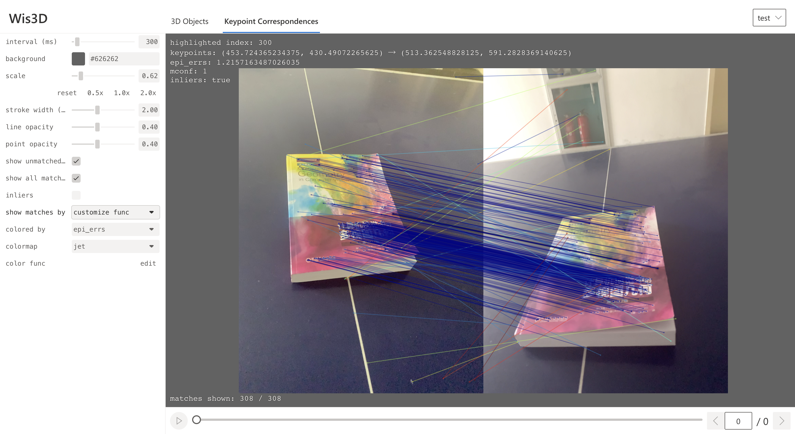

Keypoint Correspondences
************************

Keypoint Correspondences is the second tab of the Web page. The leftmost panel on the web page is the **control panel**. 
And the right part is the image and correspondences display.

Keypoint correspondences provides the display of matching keypoints and corresponding matches. At the same time, 
it can visually display the attributes of correspondences, such as confidence and epipolar distance, 
and filter and display according to the attributes of correspondences.

Add Keypoint Correspondences
============================

.. code-block:: python

    wis3d.add_keypoint_correspondences(img0, img1, kpts0, kpts1, unmatched_kpts0 = None, unmatched_kpts1 = None, metrics = None, booleans = None, meta = None, name: str = None)

* ``img0``, ``img1`` : Two images. Adding method is the same as ``wis3d.add_image``, it cannot be empty.
* ``kpts0``, ``kpts1`` : Matching keypoints of two images. Both have the same dimension and cannot be empty.
* ``umatched_kpts0``, ``umatched_kpts1`` : Keypoints that do not match in the two images. The two dimensions can be different and can be empty.
* ``metrics`` : The attributes of correspondences, such as confidence, can be empty. The dimension of each attribute is the same as ``kpts0`` and ``kpts1``. Wis3D Display the color of each match according to these attributes.
* ``booleans`` : The boolean attribute of correspondences, can be empty. It is true when certain conditions are met. And the dimension of each boolean attribute is the same as ``kpts0`` and ``kpts1``. Matches can be filtered based on these attributes.
* ``meta`` : The text information displayed in the content part, can be empty.

Visualization
=============

Wis3D can adjust the interval time of switching scenes, the color of the background, size of the image, width, transparency of lines, and transparency of points.
At the same time, Wis3D supports viewing the specific information of each match and double-clicking to highlight a match.

Simultaneously, you can set whether to display unmatched keypoints, and whether to filter matches based on ``booleans``. 
If ``metric`` exists, you can set which metric is used for display and the specific color rendering method, including ``customize func`` and ``error color func``.

``customize func`` can set the palette used for rendering, customize the rendering function, and filter matches based on the value of the metric.

Examples of ``customize func`` :

.. code-block:: javascript

    # Example 1
    const _max = 1.25 * max;
    return palette((_max - val) / _max);

    # Example 2
    const thr = 5e - 4;
    let x = val / (thr * 2);
    x = x > 0 ? (x < 1 ? x : 1) : 0;
    const r = (1 - x) * 255;
    const g = x * 255;
    const b = 0;
    return `rgb(${r}, ${g}, ${b})`;

``error color func`` can set the threshold, and use red and green to display the correct and wrong matches.

Shortcuts
=========

+------------------+-----------------------------+
|Shortcut          |Description                  |
+==================+=============================+
|``A``/``D``       |Change display scene         |
+------------------+-----------------------------+
|``W``/``S``       |Change sequence              |
+------------------+-----------------------------+
|Double            |View the specific keypoint   |
|Click on a line   |match only                   |
+------------------+-----------------------------+
|``Escape``        |Unselect the keypoint match  |
+------------------+-----------------------------+