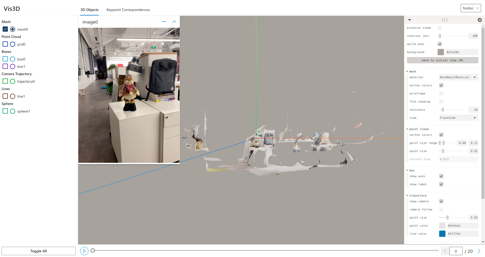

How to use Wis3D
****************

Create Wis3D API
================

The first step of using Wis3D in your project is to create the Wis3D API.

.. code-block:: python

    from wis3d import Wis3D
    wis3d = Wis3D(vis_dir, sequence_name, xyz_pattern)

The ``vis_dir`` is the directory where objects will be saved. Wis3D will create files and subdirectories under this path, 
so it's better to provide a dedicated ``vis_dir`` separate from your other files.

The ``sequence_name`` is the subdirectory of ``vis_dir``. Wis3D will create scene folders under the ``sequence_name``. You can use ``scene`` to 
save time-varying data. The default scene id is ``00000``. Different types of data will be saved in the current scene folder. 

You can switch different scenes at the bottom of the Web page. In addition, you can switch different sequences in the current ``vis_dir`` in the 
upper right corner of the page.

``xyz_pattern`` applies the mapping of the `Three.js <https://threejs.org/>`_ coordinate to the target coordinate. Default is ``xyz_pattern=('x', 'y', 'z')``

Save data
=========

Wis3D API supports meshes, point clouds, camera trajectories, voxel grids, boxes, spheres, lines, images, and keypoint correspondences. 
Use ``Wis3D.add_{types}`` to save objects and ``Wis3D.set_scene_id(scene_id)`` to switch scenes. For more, please visit :doc:`../python_api/index`.

Start Web page
==============

After adding data to the Wis3D, start the Web server.

.. code-block:: bash

    wis3d --vis_dir $vis_dir --host $host --port $port --verbose $verbose

``vis_dir`` is the same as ``vis_dir`` above.

``host`` is the hostname to run the service, default is ``0.0.0.0``.

``port`` is the port to run the service, default is 19090. If the port number is unspecified or is used, increase one by one from 19090 to find a free port.

``verbose`` decides whether to let `CherryPy <https://docs.cherrypy.dev/en/latest/>`_ log detailed information, default is ``False``.

Command line tools
==============

We provide a command line tool to help you quickly add object files to Wis3D and start the Web server without the need of writing Python code.

.. code-block:: bash

    w3dcli FILES --host HOST

``FILES`` is the files to be added to Wis3D. The files can only be files in the format of jpg, png, ply, and obj.

``HOST`` is the hostname to run the service, default is `localhost`.

This command line will automatically create a temporary directory to save the files and start the Web server. The temporary directory will be deleted after the Web server is closed.

